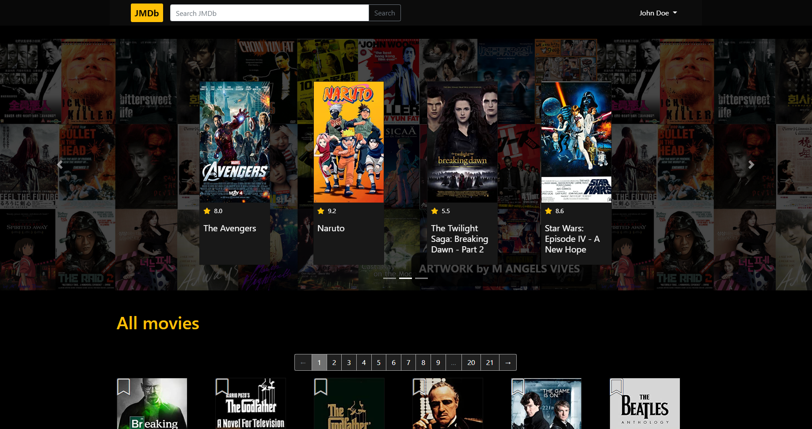
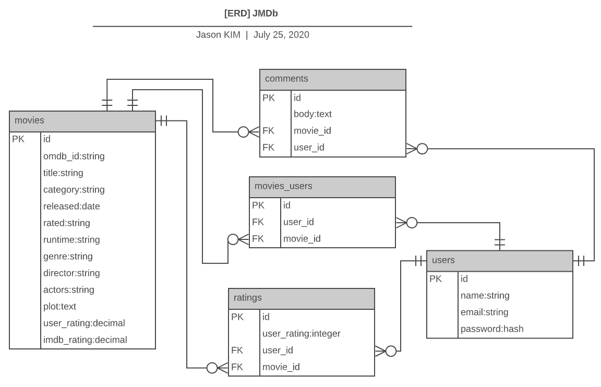

# JMDB (Jason Movie DataBase)

## Link
### Github link : https://github.com/jasonkim7288/rails_jmdb
### Deploy link : https://jmdbjason.herokuapp.com/

## Description
JMDb app is clone app of IMDb. Whenever users search some movies, movies list as a result of OMDb api will be stored to JMDb postgreSQL database. You can rate each movie, add each movie to watchlist, and even make comments on each movie.

## ERD

## Tech stack
- Rails : front end and back end source code
- Heroku : deploy the code
- Stimulus Reflex : to refresh the partial update for watchlist and comments
- Devise : login gem
- Bootstrap : a package making pages look pretty